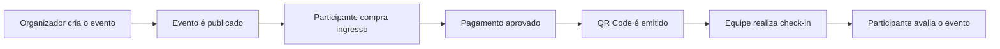
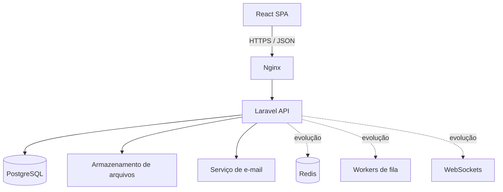

# EventHub

Plataforma de gestão e venda de ingressos para eventos presenciais. Organizadores publicam eventos, participantes compram ingressos e recebem QR Codes, enquanto equipes fazem o check-in e administradores acompanham a operação.

> Projeto de portfólio planejado como um produto real: API versionada, controle de acesso por contexto, consistência de estoque, auditoria e evolução gradual de infraestrutura.

## Objetivo

Construir uma experiência semelhante a plataformas de eventos como Sympla, cobrindo o ciclo completo de um evento:



## Principais funcionalidades

- Cadastro, autenticação, recuperação de senha e confirmação de e-mail.
- Perfis de usuário, dados pessoais e histórico de compras.
- Organizações, equipes e papéis por organização ou evento.
- Criação, publicação e gerenciamento de eventos.
- Categorias, localização, banners e galeria de imagens.
- Múltiplos tipos de ingresso, períodos de venda e controle de disponibilidade.
- Carrinho, pedidos, pagamento simulado e emissão de QR Code único.
- Check-in de entrada e saída, com rastreabilidade do operador.
- Dashboards para organizadores e administradores.
- Avaliações, denúncias, notificações e logs de auditoria.

## Stack

| Camada | Tecnologias |
|---|---|
| Front-end | React, TypeScript, Vite, Material UI, React Router, React Hook Form, Zod, TanStack Query, Axios |
| Back-end | Laravel 13, PHP 8.4, Laravel Sanctum, Pest, Swagger/OpenAPI |
| Banco de dados | PostgreSQL |
| Desenvolvimento | Docker, Docker Compose, Nginx, Mailpit e DBeaver |
| Evolução | Redis, AWS S3, GitHub Actions, WebSockets, RabbitMQ opcional |

## Arquitetura

O projeto segue o modelo de **monólito modular API-first**. O front-end e a API são aplicações independentes; o Laravel concentra os domínios de negócio sem dividi-los prematuramente em microserviços.



Leia os documentos de arquitetura antes de iniciar a implementação:

- [Visão de arquitetura](docs/architecture/overview.md)
- [Modelo de domínio e dados](docs/architecture/data-model.md)
- [Contrato e convenções da API](docs/architecture/api.md)
- [Ambiente local com Docker e DBeaver](docs/architecture/local-development.md)

## Papéis de acesso

| Papel | Escopo | Responsabilidades principais |
|---|---|---|
| Participante | Conta própria | Comprar, visualizar ingressos e avaliar eventos |
| Organizador | Organização | Gerenciar eventos, equipe e vendas |
| Gestor de evento | Evento | Operar e acompanhar um evento específico |
| Equipe de check-in | Evento | Registrar entrada e saída de participantes |
| Administrador | Plataforma | Moderar usuários, eventos, categorias e denúncias |
| Suporte | Plataforma, restrito | Consultar dados operacionais e auxiliar usuários |

Um mesmo usuário pode exercer mais de um papel. O acesso a organizações e eventos é contextual, evitando que um colaborador de um evento consiga acessar os demais.

## Estrutura planejada

```text
eventhub/
├── apps/
│   ├── web/                  # React + TypeScript
│   └── api/                  # Laravel
├── docs/
│   └── architecture/
├── infra/
│   ├── nginx/
│   └── docker/
├── compose.yaml
└── README.md
```

No Laravel, o código será organizado por domínio, e não apenas por tipo técnico:

```text
app/
├── Domains/
│   ├── Identity/
│   ├── Organizations/
│   ├── Events/
│   ├── Tickets/
│   ├── Orders/
│   ├── Checkin/
│   ├── Reviews/
│   └── Administration/
├── Http/
└── Providers/
```

## Roadmap

| Versão | Escopo |
|---|---|
| V1 — Produto funcional | Autenticação, organizações, eventos, ingressos, compra simulada, QR Code, check-in e dashboard básico |
| V2 — Recursos profissionais | S3, e-mails, PDF, cupons, busca avançada e métricas ampliadas |
| V3 — Escala | Redis, filas, WebSockets, CI/CD, logs centralizados e integração de pagamento real |

## Sprints sugeridas

1. Ambiente local, convenções, Docker, banco e documentação.
2. Identidade, autenticação, confirmação de e-mail e autorização.
3. Organizações, equipes, eventos e mídia.
4. Tipos de ingresso, estoque e regras de venda.
5. Carrinho, pedidos, pagamento simulado e QR Code.
6. Check-in de entrada e saída.
7. Dashboards e administração.
8. Testes, segurança, observabilidade e deploy.

## Princípios do projeto

- Segurança e autorização fazem parte de cada caso de uso.
- Valores monetários são armazenados em centavos, nunca em `float`.
- A venda de ingressos usa transações para impedir sobre-venda.
- Pedidos e pagamentos preservam histórico; dados financeiros não são apagados.
- QR Codes usam tokens aleatórios e não expõem dados pessoais.
- Arquivos são validados e armazenados fora do banco de dados.
- Toda API pública é versionada em `/api/v1`.
- O PostgreSQL é persistido em volume Docker; DBeaver é somente a ferramenta de conexão e inspeção.

## Status

Em fase de arquitetura e planejamento. Nenhuma aplicação foi implementada ainda.
