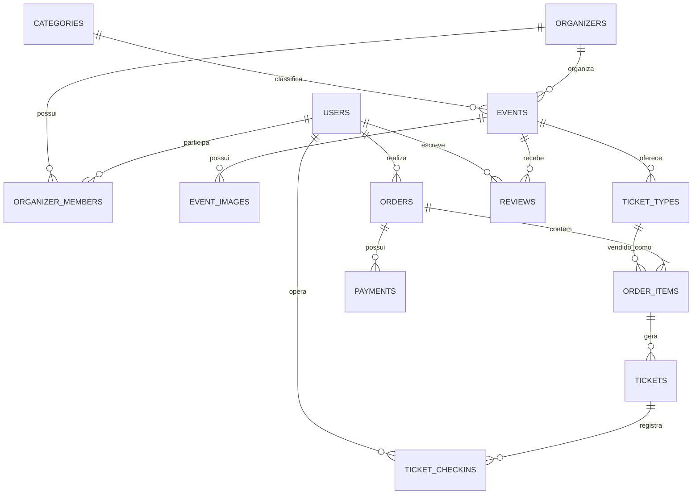

# Modelo de domínio e dados

## Entidades principais



## Tabelas

| Tabela | Finalidade | Campos e regras relevantes |
|---|---|---|
| `users` | Conta do usuário | nome, e-mail único, CPF único quando informado, telefone, foto e dados de endereço |
| `roles` / `user_roles` | Papéis globais | administração e suporte; não substitui permissões contextuais |
| `organizers` | Empresa organizadora | nome legal, nome público, documento, logo, banner e redes sociais |
| `organizer_members` | Equipe da organização | `user_id`, `organizer_id`, função e status; índice único do vínculo |
| `categories` | Classificação de eventos | nome, slug único e status |
| `events` | Evento | organização, categoria, status, datas, local, capacidade e configuração de visibilidade |
| `event_images` | Galeria | URL/chave de storage, ordem e texto alternativo |
| `event_staff` | Equipe por evento | necessário para check-in e gestão limitada a um evento |
| `ticket_types` | Produto vendido | evento, nome, preço em centavos, limite e janela de vendas |
| `ticket_batches` | Lotes futuros | preço e período para virada automática de lote; pode entrar na V2 |
| `orders` | Pedido comercial | participante, status, totais em centavos, expiração da reserva e referência pública |
| `order_items` | Itens congelados do pedido | nome/preço/snapshot do ingresso no momento da compra |
| `payments` | Tentativas de cobrança | provedor, status, valor, id externo e payload mínimo necessário para auditoria |
| `tickets` | Ingresso individual | token QR único, status, participante e vínculo com item do pedido |
| `ticket_checkins` | Histórico operacional | tipo de operação, operador, horário e resultado |
| `reviews` | Avaliação pós-evento | nota, comentário, status de moderação e unicidade por usuário/evento |
| `reports` | Denúncias | alvo denunciado, motivo, status e responsável pela análise |
| `notifications` | Notificações do usuário | canal, conteúdo, leitura e dados de referência |
| `audit_logs` | Auditoria | ator, ação, entidade, IP, user agent e alterações relevantes |

## Estados essenciais

| Entidade | Estados |
|---|---|
| Evento | `draft`, `published`, `cancelled`, `finished` |
| Pedido | `pending`, `paid`, `cancelled`, `expired`, `refunded` |
| Pagamento | `pending`, `approved`, `failed`, `cancelled`, `refunded` |
| Ingresso | `valid`, `used`, `cancelled`, `transferred` |
| Avaliação | `pending`, `published`, `hidden` |

Estados devem ser representados por enums no domínio e por constraints/validações no banco quando apropriado.

## Regras de integridade

1. Valores financeiros são inteiros em centavos (`amount_cents`), sem `float`.
2. O item do pedido guarda cópia de nome, preço e taxa aplicada para preservar o histórico, mesmo que o tipo de ingresso mude depois.
3. `tickets.qr_token` é único, aleatório e nunca é derivado do ID do ingresso.
4. Pedidos pagos, pagamentos e check-ins não são removidos fisicamente; são cancelados ou mantidos como histórico.
5. A criação de pedido e reserva de estoque é transacional.
6. A aprovação de pagamento é idempotente por referência externa do provedor.
7. O total vendido não pode ultrapassar a capacidade efetivamente disponível do tipo de ingresso.

## Índices iniciais

```text
events(status, starts_at)
events(organizer_id, status)
events(category_id, starts_at)
ticket_types(event_id, sales_starts_at, sales_ends_at)
orders(user_id, status, created_at)
orders(public_id) UNIQUE
payments(provider, external_reference) UNIQUE
tickets(qr_token) UNIQUE
tickets(order_id)
ticket_checkins(ticket_id, checked_at)
reviews(event_id, status)
audit_logs(actor_id, created_at)
```

## Privacidade

CPF, endereço e telefone não devem aparecer em listagens públicas ou respostas de API que não precisem desses dados. Consultas de check-in retornam somente o necessário para identificação operacional; relatórios e exportações devem passar por autorização explícita e deixar rastros em auditoria.
