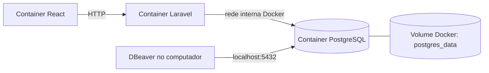

# Ambiente local: Docker, PostgreSQL e DBeaver

## Princípio

O projeto terá conexão real com PostgreSQL desde a V1. O banco será executado pelo Docker Compose e persistirá os dados em um volume nomeado do Docker.

O **DBeaver não é o banco de dados**: ele é a interface gráfica usada para se conectar ao PostgreSQL, visualizar tabelas, consultar dados e inspecionar problemas. Laravel, DBeaver e qualquer ferramenta de linha de comando devem apontar para a mesma instância de banco.



## Serviços previstos no Docker Compose

| Serviço | Função | Porta local sugerida |
|---|---|---|
| `nginx` | Entrada única para front-end e API | `80` ou `8080` |
| `web` | React/Vite em desenvolvimento | `5173` quando usado diretamente |
| `api` | Laravel/PHP-FPM | Não exposta diretamente em produção |
| `postgres` | Banco PostgreSQL real | `5432` |
| `mailpit` | Captura de e-mails em desenvolvimento | `8025` |
| `worker` (V2) | Processa filas Laravel | Sem porta |
| `redis` (V2) | Cache, filas e rate limit | `6379`, se necessário para diagnóstico |

Em desenvolvimento, manter `5432` exposta permite conexão simples pelo DBeaver. Em produção, PostgreSQL não deve estar exposto à internet; somente a API e a rede administrativa autorizada devem alcançá-lo.

## Configuração de conexão no DBeaver

Ao iniciar o projeto, crie uma conexão PostgreSQL com os valores definidos no arquivo `.env` local. A convenção proposta é:

| Campo no DBeaver | Valor local padrão |
|---|---|
| Host | `localhost` |
| Porta | `5432` |
| Banco | `eventhub` |
| Usuário | `eventhub` |
| Senha | Valor de `POSTGRES_PASSWORD` no `.env` |
| SSL | Desativado no ambiente local |

Esses valores são defaults locais e não podem ser usados como segredos de produção. O arquivo `.env` jamais será versionado; apenas um `.env.example` sem senha real fará parte do repositório.

## Variáveis de ambiente necessárias

```dotenv
# PostgreSQL (Docker Compose)
POSTGRES_DB=eventhub
POSTGRES_USER=eventhub
POSTGRES_PASSWORD=troque-esta-senha-local
POSTGRES_PORT=5432

# Laravel, dentro da rede Docker
DB_CONNECTION=pgsql
DB_HOST=postgres
DB_PORT=5432
DB_DATABASE=eventhub
DB_USERNAME=eventhub
DB_PASSWORD=troque-esta-senha-local
```

O detalhe importante é `DB_HOST=postgres`: dentro do Docker, Laravel localiza o banco pelo nome do serviço, e não por `localhost`. O DBeaver, por estar fora da rede Docker, usa `localhost` e a porta publicada.

## Persistência dos dados

O serviço PostgreSQL utilizará um volume nomeado semelhante a `postgres_data`, montado em `/var/lib/postgresql/data` no container. O ciclo esperado é:

```text
docker compose stop             → para os serviços e mantém os dados
docker compose down             → remove containers e rede; mantém o volume por padrão
docker compose up -d            → recria os serviços usando os dados existentes
docker compose down -v          → remove também o volume e APAGA os dados locais
```

`docker compose down -v` só deve ser usado quando houver intenção explícita de reiniciar o banco local. Para dados de teste relevantes, realize um dump antes.

## Migrations, seeds e DBeaver

| Operação | Fonte de verdade |
|---|---|
| Criar ou alterar tabelas | Migrations do Laravel versionadas no Git |
| Dados mínimos de desenvolvimento | Seeders/factories do Laravel |
| Visualizar e consultar tabelas | DBeaver |
| Investigar consultas e índices | DBeaver e ferramentas PostgreSQL |
| Alteração emergencial de dados | Procedimento auditável, nunca alteração estrutural manual |

O DBeaver não deve criar tabelas ou colunas diretamente em ambientes compartilhados, porque isso deixaria a estrutura fora do histórico das migrations e quebraria a reprodutibilidade do projeto.

## Backup e restauração

No ambiente local, os dumps podem ser gerados com `pg_dump` executado dentro do container e armazenados fora do volume do PostgreSQL. Em produção, o banco deve ter backups automatizados, retenção definida, criptografia e teste periódico de restauração.

Regras mínimas:

1. Backup antes de migrations destrutivas ou mudanças massivas de dados.
2. Backup não é validado até que uma restauração seja testada.
3. Arquivos de backup não entram no Git.
4. Produção usa credenciais, volume e política de backup próprios.

## Caminho para produção

O desenho local espelha a arquitetura de produção: API fala com PostgreSQL pela rede privada, arquivos ficam em storage e tarefas pesadas são processadas em background. A mudança principal será substituir o volume local por PostgreSQL gerenciado ou uma instância com backup monitorado, e mover mídia para S3 ou equivalente.
