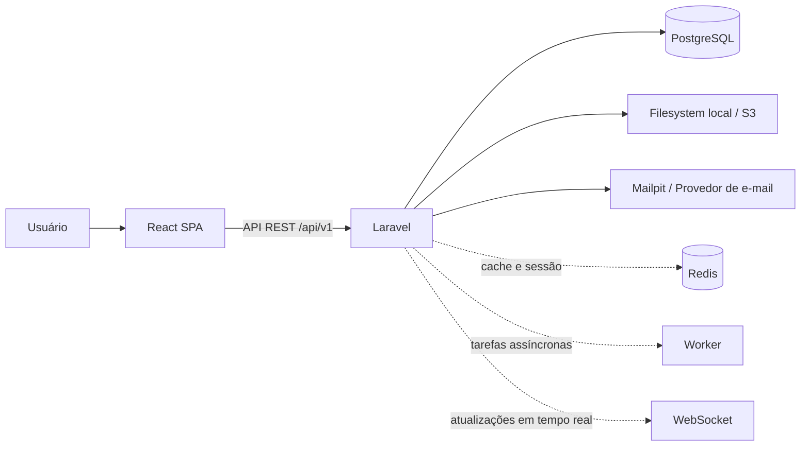
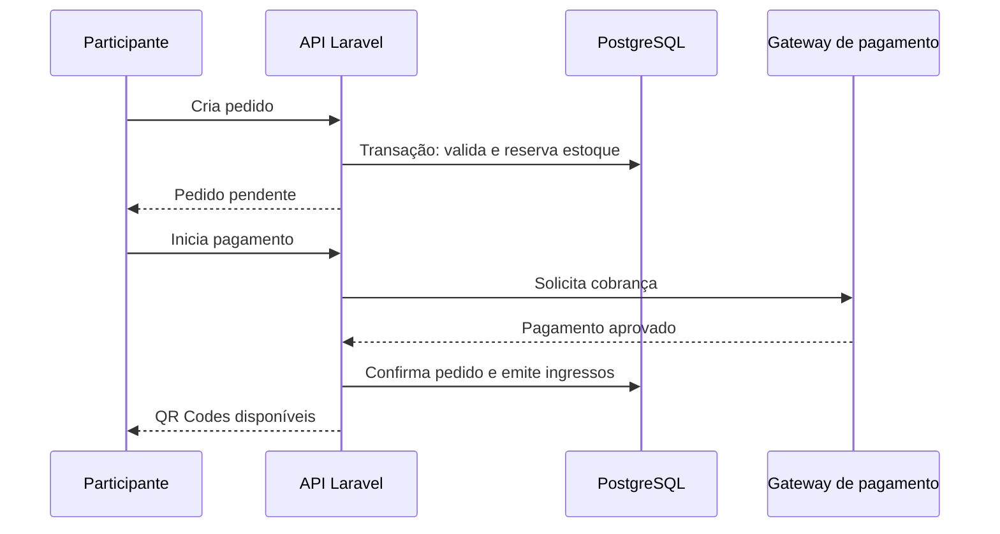

# Visão de arquitetura

## Decisão principal

O EventHub começa como um **monólito modular** com uma API REST em Laravel e uma SPA em React. Essa arquitetura oferece uma fronteira clara entre interface e regras de negócio, mas mantém deploy, depuração e transações simples durante a fase inicial do produto.

Microserviços não são necessários na V1. Eles aumentariam o custo operacional, a complexidade de observabilidade e as falhas distribuídas sem existir uma necessidade comprovada de escala independente.

## Componentes

| Componente | Responsabilidade |
|---|---|
| React SPA | Interface pública, painel do organizador, administrativo e operação de check-in |
| Nginx | Terminação HTTPS, entrega do front-end e proxy reverso para a API |
| Laravel API | Autenticação, autorização, regras de negócio, integrações, validação e documentação OpenAPI |
| PostgreSQL | Fonte transacional de dados do produto, persistida em volume Docker no desenvolvimento |
| Storage | Banners, logos, galeria e futuros PDFs de ingresso |
| Redis (futuro) | Cache, rate limit, filas e possíveis bloqueios de curta duração |
| Worker (futuro) | E-mail, geração de PDF, expiração de pedidos e outras tarefas assíncronas |

## Fronteiras de domínio

| Domínio | Responsabilidade |
|---|---|
| Identity | Usuários, autenticação, confirmação de e-mail, senha e perfis globais |
| Organizations | Empresas organizadoras, membros e permissões no contexto da organização |
| Events | Eventos, categorias, publicação, localização e mídia |
| Tickets | Tipos de ingresso, disponibilidade, lotes e regras de venda |
| Orders | Carrinho, pedidos, reserva de estoque, pagamentos e emissão de ingressos |
| Checkin | Validação de QR Code, entradas, saídas e operação da equipe |
| Reviews | Avaliações pós-evento e moderação associada |
| Administration | Categorias, denúncias, moderação, métricas globais e auditoria |

Cada domínio expõe casos de uso — por exemplo, `PublishEvent`, `CreateOrder` ou `RegisterCheckin` — em vez de concentrar regras em controllers. Controllers recebem requisições, validam a entrada, delegam ao caso de uso e retornam resources HTTP.

## Autenticação e autorização

Para a SPA, a primeira escolha é **Laravel Sanctum**. Ele integra bem com Laravel e oferece uma abordagem simples para autenticação via cookie seguro ou tokens pessoais, conforme a estratégia de hospedagem do front-end.

Autorização terá duas camadas:

1. Papéis globais, para administração e suporte.
2. Vínculos contextuais em `organizer_members` e `event_staff`, para limitar o acesso à organização ou ao evento correto.

Laravel Policies devem validar a posse/contexto antes de permitir edição de eventos, consulta de pedidos, leitura de participantes ou check-in. A interface só melhora a experiência; a API é a autoridade final de permissões.

## Fluxo de venda e consistência

O pedido terá prazo de expiração. Enquanto estiver pendente, seu estoque fica reservado; uma tarefa assíncrona cancela pedidos expirados e libera essas vagas. A confirmação de pagamento deve ser idempotente: uma notificação repetida do gateway não pode criar ingressos duplicados.

## Check-in

O QR Code contém apenas um token aleatório, de alta entropia e único por ingresso. A API pesquisa o token, valida status do ingresso, período do evento e permissão do operador, e registra a operação em transação.

O check-in deve registrar, no mínimo: ingresso, evento, tipo de ação (`entry` ou `exit`), data/hora, usuário operador, dispositivo quando disponível e resultado. Leituras repetidas precisam ter comportamento previsível e mensagens claras para a equipe.

## Escalabilidade gradual

| Momento | Evolução |
|---|---|
| V1 | Aplicação única, PostgreSQL, arquivos locais e jobs síncronas apenas quando aceitável |
| V2 | S3, Redis e worker dedicado para e-mails, expiração de pedidos e geração de documentos |
| V3 | WebSockets para métricas ao vivo, cache de catálogo, CI/CD, observabilidade e integração de pagamento real |

O PostgreSQL continua como fonte de verdade. Redis não deve ser usado para persistir pedidos, pagamentos ou check-ins.

## Segurança e observabilidade

- HTTPS obrigatório fora do ambiente local.
- Rate limit para login, recuperação de senha, criação de pedido e leitura de QR Code.
- Senhas com hashing do Laravel; tokens com expiração e revogação.
- CPF e endereço tratados como dados sensíveis: mascaramento e acesso mínimo necessário.
- Upload com validação de MIME, tamanho e dimensões; arquivos com nomes gerados pelo servidor.
- `audit_logs` para alterações administrativas, mudanças de preços, cancelamentos e operações críticas.
- Logs estruturados com ID de requisição para correlacionar falhas.
- Backups automatizados e testes de restauração antes de produção.

## Persistência e acesso ao banco

PostgreSQL é um componente real da aplicação desde a primeira versão, não um banco em memória ou um mock de desenvolvimento. No ambiente local, ele será executado em um container Docker com volume nomeado. Isso garante que recriar os containers não apague eventos, usuários, pedidos e demais dados.

O DBeaver é usado para acessar essa mesma instância PostgreSQL, conferir migrations, explorar dados, executar consultas e auxiliar em diagnósticos. Ele não substitui migrations nem deve ser usado para alterações manuais de estrutura: a estrutura oficial do banco é sempre versionada nas migrations do Laravel.

Os detalhes de conexão, variáveis obrigatórias, portas e estratégia de backup estão definidos no documento de [ambiente local](local-development.md).
